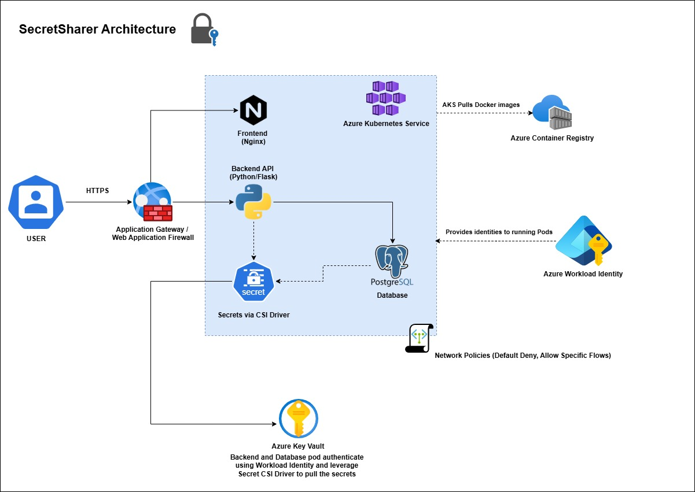

# Secure Secret Sharer: A Cloud-Native Security Showcase

## 🚀 Executive Summary

Secure Secret Sharer is a production-grade application designed for sharing sensitive text-based information securely. Users can create self-destructing, encrypted notes that are accessible via a unique one-time link. Once viewed, the secret is permanently deleted.

This project serves as a comprehensive demonstration of **cloud-native security best practices** and **defense-in-depth strategies** deployed on **Azure Kubernetes Service (AKS)**. It showcases expertise in securing containerized applications, managing secrets with Azure Key Vault, implementing robust network policies, and leveraging Azure Workload Identity for secure, credential-less access to cloud resources.

## 🎬 Application Demo

Watch this short GIF to see how Secure Secret Sharer allows users to create, share, and view one-time secrets:

The flow demonstrated includes:
1.  User composes a secret message.
2.  A unique, one-time access link is generated.
3.  The secret is viewed via the link, after which it's no longer accessible.

## 🎯 Project Goal

The primary goal of this project is to design, build, and deploy a secure multi-container application on Azure Kubernetes Service, focusing on:
* Implementing end-to-end security controls for sensitive data handling.
* Demonstrating practical application of cloud security principles in a Kubernetes environment.
* Showcasing skills relevant to a Cloud Security Engineer role, including secure infrastructure provisioning, container security, identity and access management, and network security.

## 👁️‍🗨️ Architecture Overview

The application follows a tiered architecture:

1.  **Frontend**: A static web interface (HTML/JavaScript/CSS) served by a hardened Nginx container, responsible for user interaction.
2.  **Backend API**: A Python (Flask) application providing core encryption, decryption, and secret management logic.
3.  **Database**: A containerized PostgreSQL instance for storing encrypted secrets, with strong authentication and specific user roles.
4.  **Secure Azure Infrastructure**:
    * **Azure Kubernetes Service (AKS)**: Hosts the application containers, configured with security best practices like OIDC Issuer and Workload Identity.
    * **Azure Key Vault (AKV)**: Securely stores all sensitive application data, including the master encryption key and database credentials. Access is controlled via Azure RBAC and User Assigned Managed Identities.
    * **Azure Container Registry (ACR)**: Stores hardened Docker images, scanned for vulnerabilities.
    * **Azure Application Gateway (AppGW)**: Provides secure L7 load balancing and ingress control for the application, managed by the Application Gateway Ingress Controller (AGIC).
      

## ✨ Core Features

* **End-to-End Encryption**: Secrets are encrypted at rest (in the database) and in transit (via HTTPS, managed by Application Gateway). The backend uses a master encryption key (Fernet) stored in Azure Key Vault for cryptographic operations.
* **One-Time Access Links**: Generated links are valid for a single view only. Once a secret is retrieved, it's permanently deleted from the database.
* **Self-Destructing Secrets**: Secrets are automatically purged after being viewed or after an expiry period if unaccessed.
* **Secure User Interface**: A clean, intuitive frontend for creating and sharing secrets.
* **Health Check Endpoints**: For monitoring application status.

## 🛡️ Key Security Controls & Highlights

This project emphasizes a defense-in-depth approach, implementing multiple layers of security:

* **Azure Workload Identity**: Enables Kubernetes workloads (backend API, database initialization) to access Azure resources (specifically Azure Key Vault) securely using federated identity credentials, eliminating the need to store static credentials within the application or Kubernetes Secrets.
* **Azure Key Vault Integration with CSI Driver**: The Secrets Store CSI driver for Kubernetes is used to mount secrets from Azure Key Vault directly into pods as volumes. This allows the application to access sensitive data like database passwords and the master encryption key without them being stored in Kubernetes Secrets directly accessible via `kubectl`.
* **Container Security**:
    * **Hardened Docker Images**: Multi-stage builds are used to create minimal, production-ready images. Containers run as non-root users.
    * **Vulnerability Scanning**: Implemented Trivy for scanning container images for known vulnerabilities, with a process to remediate HIGH and CRITICAL findings. Example: Addressed `libxml2` vulnerabilities in the frontend image.
    * **Azure Container Registry (ACR)**: Securely stores and manages container images. AKS is configured to pull images securely from ACR.
* **Kubernetes Network Policies**: Zero-trust network policies are implemented to restrict traffic flow between pods within the AKS cluster. This includes:
    * Default deny-all for ingress and egress traffic in the application namespace.
    * Specific allow rules for:
        * Backend to Database communication on port 5432.
        * Ingress Controller (AGIC) to Frontend pods.
        * Ingress Controller (AGIC) to Backend pods for API requests.
        * DNS resolution.
* **Secure Ingress with Azure Application Gateway**:
    * The Azure Application Gateway Ingress Controller (AGIC) manages the Application Gateway, providing a secure L7 load balancing solution.
    * (Future enhancement: HTTPS termination with cert-manager and Let's Encrypt).
* **Role-Based Access Control (RBAC)**:
    * **Kubernetes RBAC**: Least-privilege service accounts, roles, and role bindings are defined for application components. For example, the backend service account has specific permissions to read the Kubernetes secret synced by the CSI driver.
    * **Azure RBAC**: User Assigned Managed Identities (UAMIs) are granted "Key Vault Secrets User" role on Azure Key Vault to access necessary secrets.
* **Secure Database Initialization**: The database initialization script uses secrets mounted via the CSI driver to create the application database user and set its password, avoiding hardcoded credentials.
* **Input Validation (Basic)**: The backend API includes basic input validation, such as checking for the presence and type of the secret and enforcing a maximum length.
* **Resource Management**: Kubernetes deployments define resource requests and limits for containers to ensure stable operation and prevent resource exhaustion.
* **Logging**: The application incorporates logging for monitoring and troubleshooting. (Future: structured logging to Azure Monitor).

## 🛠️ Technologies Used

* **Cloud Provider**: Microsoft Azure
* **Containerization & Orchestration**: Docker, Azure Kubernetes Service (AKS)
* **Backend**: Python, Flask
* **Database**: PostgreSQL
* **Frontend**: HTML, CSS, JavaScript
* **Secrets Management**: Azure Key Vault, Secrets Store CSI Driver for Kubernetes, Azure Workload Identity
* **Networking**: Azure Application Gateway, AGIC, Kubernetes Network Policies
* **Container Image Scanning**: Trivy
* **Infrastructure as Code**: Bicep (fully implemented for Azure resource provisioning via build_dev.sh script) 
* **Deployment**: Helm, Bash (build_dev.sh)

## 💡 Challenges & Solutions / Lessons Learned

* **Challenge**: Securely providing application access to database credentials and the master encryption key without hardcoding or using less secure Kubernetes secrets.
    * **Solution**: Implemented **Azure Workload Identity** federated with Kubernetes Service Accounts and the **Azure Key Vault Provider for Secrets Store CSI Driver**. This allows pods to acquire Azure AD tokens and access Key Vault secrets directly, which are then mounted as files or synced to Kubernetes secrets with restricted RBAC. This aligns with zero-trust principles by eliminating static credentials in the application's configuration or code.
* **Challenge**: Ensuring secure network traffic flow within the AKS cluster (pod-to-pod communication).
    * **Solution**: Designed and implemented **Kubernetes Network Policies** with a default-deny stance. Specific ingress and egress rules were created to allow only legitimate traffic paths (e.g., backend to database, ingress to frontend/backend). This enforces a micro-segmentation strategy within the cluster.
* **Challenge**: Managing and remediating container image vulnerabilities.
    * **Solution**: Integrated **Trivy vulnerability scanning** into the image management lifecycle (conceptually in CI/CD). Established a process for identifying and remediating vulnerabilities, particularly HIGH and CRITICAL ones, by updating base images or specific packages (e.g., `libxml2` for the frontend).
* **Challenge**: Securely exposing the application to the internet.
    * **Solution**: Leveraged **Azure Application Gateway with the AGIC add-on** for AKS. This provides a managed, secure ingress point with capabilities like L7 load balancing and potential for WAF integration (though WAF not explicitly in MVP).

## ⚙️ Setup & Deployment

For detailed technical instructions on setting up the Azure environment, building images, and deploying the application using Helm, please refer to the [DEPLOYMENT.md](DEPLOYMENT.md) guide.

The `build_dev.sh` script provides an automated way to deploy the necessary Azure infrastructure using Bicep and then deploy the application.

## 🗺️ Roadmap & Future Enhancements

This project is under **active development**. Key upcoming enhancements include:

* **🚀 Implement Full CI/CD Pipeline Automation (Next Priority)**:
    * Establish a robust CI/CD pipeline (e.g., GitHub Actions or Azure DevOps) integrating automated security scanning (SAST, DAST, container scanning), testing, and secure deployment strategies.
* **Low-Cost 24x7 Demo Environment**:
    * Explore deploying the application to **Azure Container Apps** to provide a cost-effective, continuously available demonstration platform.
* **Formal Threat Modeling**:
    * Conduct a detailed STRIDE (Spoofing, Tampering, Repudiation, Information Disclosure, Denial of Service, Elevation of Privilege) analysis to proactively identify and mitigate potential security threats.

## 👨‍💻 Author

**Tiago Nunes**
* Cloud Security Engineer
* [LinkedIn Profile](https://www.linkedin.com/in/tiago-nunes1491/)
* [GitHub Profile](https://github.com/tiagonunes1491)
