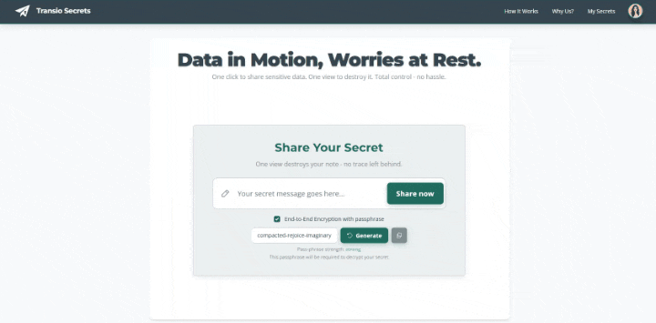

# Transio: Cloud-Native Security Showcase
[](https://github.com/tiagonunes1491/Transio/blob/main/LICENSE)

**Secure secret sharing with pass‑phrase end‑to‑end encryption *or* managed‑key encryption, plus self‑destructing links — purpose‑built to eliminate secret sprawl across teams and incident‑response workflows.**

Transio is a production‑grade reference application showcasing **cloud‑native security best practices** and **defense‑in‑depth** on Azure. Deploy on Azure Kubernetes Service (AKS) for full control, or go serverless with Static Web Apps (SWA) + Container Apps. Users create encrypted notes that auto‑erase after a single view.


<div style="text-align: center; padding: 1rem; border: 1px solid #4CAF50; border-radius: 5px; margin-bottom: 1.5rem; background-color: #e8f5e9;"> <strong>👀 See it live! &rarr;</strong> <a href="https://transio.tiagonunes.cloud" target="_blank" rel="noopener"><strong>transio.tiagonunes.cloud</strong></a> </div>




---

## 📖 Complete Documentation

👉 **[View the full docs](https://tiagonunes1491.github.io/Transio/)** for architecture overview, security controls, problem & solution details, and roadmap.

---

## 🚀 Quick Start with Docker Compose

Spin up Transio and its dependencies locally in your environment using Docker Compose:

```bash
# Prerequisites: Docker, Docker Compose
git clone https://github.com/tiagonunes1491/Transio.git
cd Transio

# Build images and bring up all services
docker-compose up --build -d

# Tail logs to verify services are running
docker-compose logs -f
```

Once started, services are available at:

* **Cosmos DB Emulator (HTTPS)**: [https://localhost:8081](https://localhost:8081)

  * Ports mapped: 8081, 10251, 10252, 10253, 10254
* **Backend API (Flask)**: [http://localhost:5000](http://localhost:5000)
* **Frontend (Nginx)**: [http://localhost:8080](http://localhost:8080)

When you’re done, shut everything down with:

```bash
docker-compose down
```


---

## ✨ Key Features

| Category                  | Highlights                                                                                          |
| ------------------------- | --------------------------------------------------------------------------------------------------- |
| **Encryption**            | **Dual‑mode:** pass‑phrase E2EE (all crypto client‑side) *or* Fernet keys stored in Azure Key Vault |
| **Zero Residual Secrets** | One‑time links and Cosmos DB TTL ensure secrets are wiped after a single view                       |
| **Enterprise Security**   | OWASP Top 10 coverage, Trivy & CodeQL scans, 85 %+ unit‑test coverage                               |
| **Flexible Deployment**   | AKS for Kubernetes workloads • SWA + Container Apps for serverless scale                            |
| **IaC & Automation**      | Modular Bicep templates, Helm charts, GitHub Actions pipeline                                       |

### Impact Highlights

* **Zero residual secrets** guaranteed by a 24-hour Time-to-Live (TTL) on all Cosmos DB records
* **< 15 min** from `git push` to production via GitHub Actions
* **99.99 %** uptime target using AZ‑replicated Cosmos DB & AKS node pools

---

## 🏗️ Deployment Options

| Option                                          | Architecture                                                  | Ideal For                                                    |
| ----------------------------------------------- | ------------------------------------------------------------- | ------------------------------------------------------------ |
| **[AKS](infra/20-platform-aks/)**                      | Kubernetes + Application Gateway                              | Enterprises needing fine‑grained control & custom networking |
| **[SWA + Container Apps](infra/20-platform-swa/)** | Globally distributed static front‑end + serverless containers | Teams prioritizing minimal ops overhead                      |

Dive deeper:

* **[AKS Guide](infra/20-platform-aks/README.md)** — Bicep modules, Helm charts, CI/CD
* **[SWA + CA Guide](infra/20-platform-swa/README.md)** — Fully serverless Bicep templates & best practices

---

## 🛠️ Technology Stack

| Layer           | Technologies                                 |
| --------------- | -------------------------------------------- |
| **Frontend**    | HTML5 · JavaScript · Nginx                   |
| **Backend**     | Python Flask · Azure Container Apps / AKS    |
| **Data Store**  | Azure Cosmos DB (TTL)                        |
| **IaC & CI/CD** | GitHub Actions · Bicep · Helm                |
| **Security**    | Azure Key Vault · Managed Identities · Trivy |

---

## 👤 About the Author

**Tiago Nunes** — Cloud Security Engineer who designs and delivers resilient, encrypted, and audit‑ready workloads on Azure.

> *Designed Transio to eradicate secret‑sharing risk and demonstrate scalable zero‑trust patterns.*

Connect on [LinkedIn](https://www.linkedin.com/in/tiago-nunes1491/) • Explore code on [GitHub](https://github.com/tiagonunes1491)
