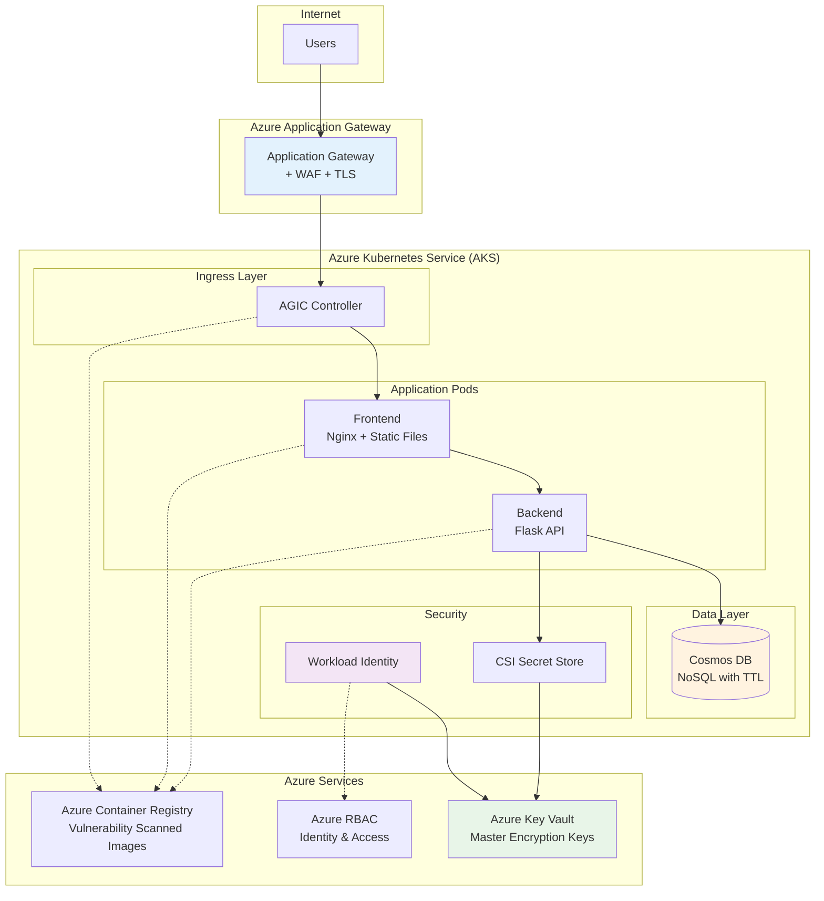
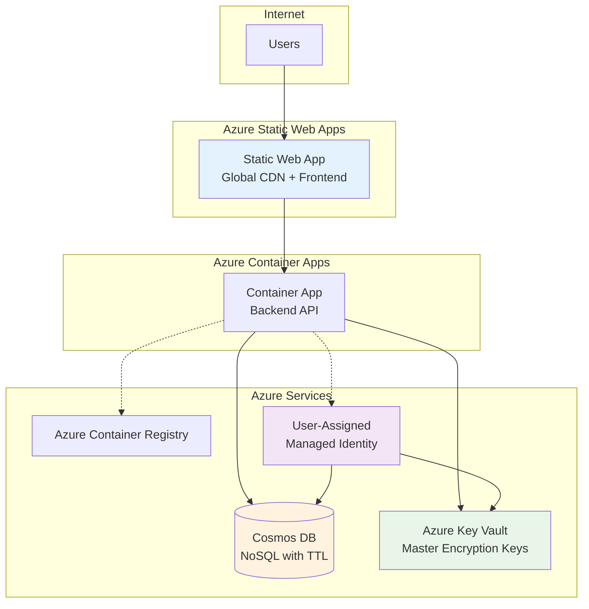
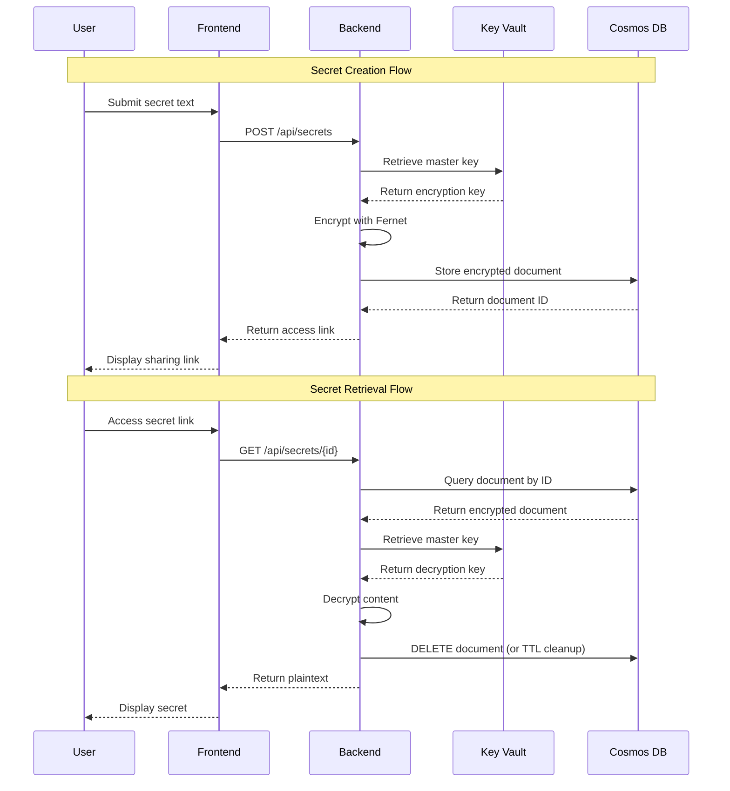

# Architecture Overview

## System Architecture

Transio follows a **tiered, cloud-native architecture** designed for security, scalability, and operational excellence. Available in two deployment patterns:

- **Azure Kubernetes Service (AKS)**: Full containerized deployment with Application Gateway for enterprise scenarios
- **Static Web Apps (SWA) + Container Apps**: Serverless frontend with containerized backend for cost-effective 24x7 operations



### Static Web Apps (SWA) Architecture

For the SWA deployment pattern, the architecture leverages Azure's serverless offerings:



## Component Details

### Frontend Layer
**Technology**: Nginx 1.28 Alpine + Static HTML/JavaScript/CSS

- **Hardened Container**: Non-root user, minimal attack surface
- **Static Content**: HTML, CSS, JavaScript for user interface
- **Client-Side Crypto**: Argon2 for client-side key derivation
- **Security Headers**: CSP, HSTS, X-Frame-Options configured

```yaml
# Frontend Security Configuration
securityContext:
  runAsNonRoot: true
  runAsUser: 101
  allowPrivilegeEscalation: false
  readOnlyRootFilesystem: true
```

### Backend API
**Technology**: Python 3.11 + Flask + Gunicorn

- **RESTful API**: Clean endpoints for secret management
- **Encryption Engine**: Fernet symmetric encryption with Key Vault integration
- **Input Validation**: Comprehensive validation and sanitization
- **Health Checks**: Kubernetes-native liveness and readiness probes

#### Key Endpoints
| Endpoint | Method | Purpose |
|----------|--------|---------|
| `/api/secrets` | POST | Create new encrypted secret |
| `/api/secrets/<id>` | GET | Retrieve and delete secret |
| `/api/health` | GET | Application health status |
| `/api/ready` | GET | Readiness probe for Kubernetes |

### Database Layer
**Technology**: Azure Cosmos DB (NoSQL) with automatic TTL

- **Document Model**: JSON documents optimized for secret storage with automatic cleanup
- **Global Distribution**: Multi-region support with configurable consistency levels
- **Automatic TTL**: Built-in time-to-live for self-destructing secrets
- **Encryption**: Automatic encryption at rest and in transit
- **Partition Strategy**: Optimized partitioning by link_id for performance

```json
// Core secret document schema
{
  "id": "unique-link-id",
  "link_id": "unique-link-id", 
  "encrypted_secret": "base64-encoded-encrypted-data",
  "is_e2ee": false,
  "mime_type": "text/plain",
  "created_at": "2024-01-01T00:00:00Z",
  "ttl": 86400
}
```

## Cryptographic Flow

The encryption and decryption process ensures end-to-end security:



## Security Architecture

### Identity and Access Management

**Azure Workload Identity** provides credential-less access to Azure resources:

```yaml
# Workload Identity Configuration
apiVersion: v1
kind: ServiceAccount
metadata:
  name: transio-backend
  annotations:
    azure.workload.identity/client-id: "12345678-1234-1234-1234-123456789012"
---
apiVersion: apps/v1
kind: Deployment
metadata:
  name: transio-backend
spec:
  template:
    metadata:
      labels:
        azure.workload.identity/use: "true"
    spec:
      serviceAccountName: transio-backend
```

### Network Security

**Defense in Depth** with multiple security layers:

- **Azure Application Gateway**: L7 load balancing, WAF protection, TLS termination
- **Network Policies**: Kubernetes-native traffic segmentation
- **Service Mesh** (Future): mTLS for pod-to-pod communication
- **Private Endpoints**: Secure connectivity to Azure services

### Secret Management

**Azure Key Vault Integration** via CSI Secret Store:

```yaml
# Secret Store CSI Driver Configuration
apiVersion: secrets-store.csi.x-k8s.io/v1
kind: SecretProviderClass
metadata:
  name: transio-secrets
spec:
  provider: azure
  parameters:
    keyvaultName: "transio-kv-dev"
    cloudName: ""
    objects: |
      array:
        - objectName: "encryption-key"
          objectType: "secret"
```

## Deployment Architecture

### Infrastructure as Code

**Bicep Templates** for reproducible infrastructure:

```
infra/
├── 0-landing-zone/     # Foundational identities and RBAC
├── 10-bootstrap-kv/    # Key Vault and secrets
├── 20-platform-aks/   # AKS cluster configuration (Enterprise deployment)
├── 20-platform-swa/   # SWA platform infrastructure (24x7 cost-effective)
└── 30-workload-swa/   # SWA application deployment
```

**Deployment Options**:
- **AKS Platform**: Full Kubernetes deployment with Application Gateway for enterprise scenarios
- **SWA Platform**: Static Web Apps + Container Apps for cost-effective 24x7 demonstrations and serverless workloads

### CI/CD Pipeline

**GitHub Actions** with security scanning:

1. **Source Control**: Branch protection, signed commits
2. **Build Stage**: Container image creation and scanning
3. **Security Scanning**: SAST, dependency scanning, container vulnerabilities
4. **Deployment**: Helm charts with environment promotion
5. **Monitoring**: Health checks and observability

```yaml
# CI/CD Security Gates
- name: Container Security Scan
  uses: ./.github/workflows/reusable-container-scan.yml
- name: SAST Analysis
  uses: ./.github/workflows/reusable-sast-scan.yml
- name: Dependency Check
  uses: ./.github/workflows/reusable-sca-scan.yml
```

## Performance & Scalability

### Horizontal Scaling

**AKS Deployment** - Kubernetes-native autoscaling:

```yaml
apiVersion: autoscaling/v2
kind: HorizontalPodAutoscaler
metadata:
  name: transio-backend-hpa
spec:
  scaleTargetRef:
    apiVersion: apps/v1
    kind: Deployment
    name: transio-backend
  minReplicas: 2
  maxReplicas: 10
  metrics:
  - type: Resource
    resource:
      name: cpu
      target:
        type: Utilization
        averageUtilization: 70
```

**SWA Deployment** - Serverless scaling:
- **Frontend**: Global CDN with automatic edge caching
- **Backend**: Container Apps with scale-to-zero capabilities
- **Database**: Cosmos DB with automatic scaling based on throughput

### Resource Management

**AKS Deployment** - Kubernetes resource allocation:

| Component | CPU Request | Memory Request | CPU Limit | Memory Limit |
|-----------|-------------|----------------|-----------|--------------|
| Frontend | 100m | 128Mi | 200m | 256Mi |
| Backend | 200m | 256Mi | 500m | 512Mi |

**SWA Deployment** - Serverless resource management:
- **Frontend**: Automatically managed by Azure Static Web Apps CDN
- **Backend**: Container Apps with dynamic resource allocation based on demand
- **Database**: Cosmos DB with Request Unit (RU) based consumption pricing

## Disaster Recovery

### Backup Strategy
- **Database**: Automated daily backups with 30-day retention
- **Configuration**: GitOps with Infrastructure as Code
- **Secrets**: Azure Key Vault geo-replication
- **Container Images**: ACR geo-replication

### High Availability
- **Multi-AZ Deployment**: Pods distributed across availability zones (AKS) or global distribution (SWA)
- **Database Clustering**: Cosmos DB with multi-region writes and automatic failover
- **Load Balancing**: Azure Application Gateway with health probes (AKS) or global CDN (SWA)
- **Circuit Breakers**: Resilient API communication patterns

---

*Next: Explore the comprehensive [security controls](security.md) implemented in Transio.*