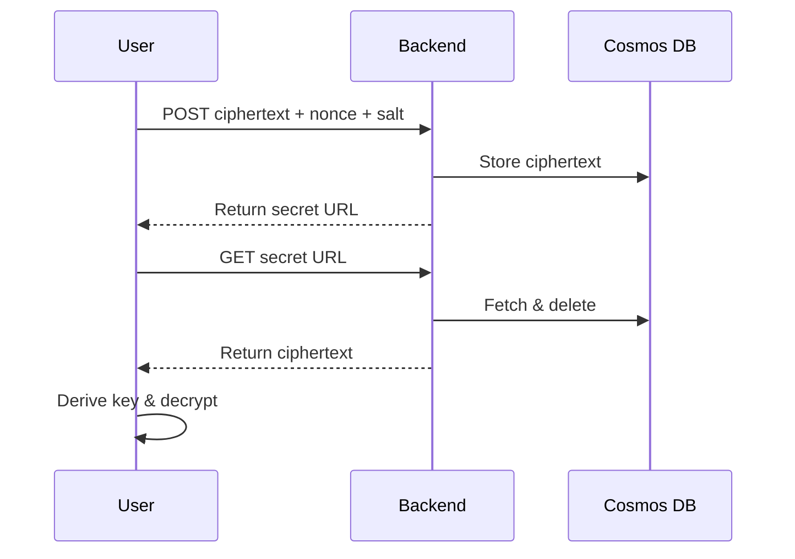
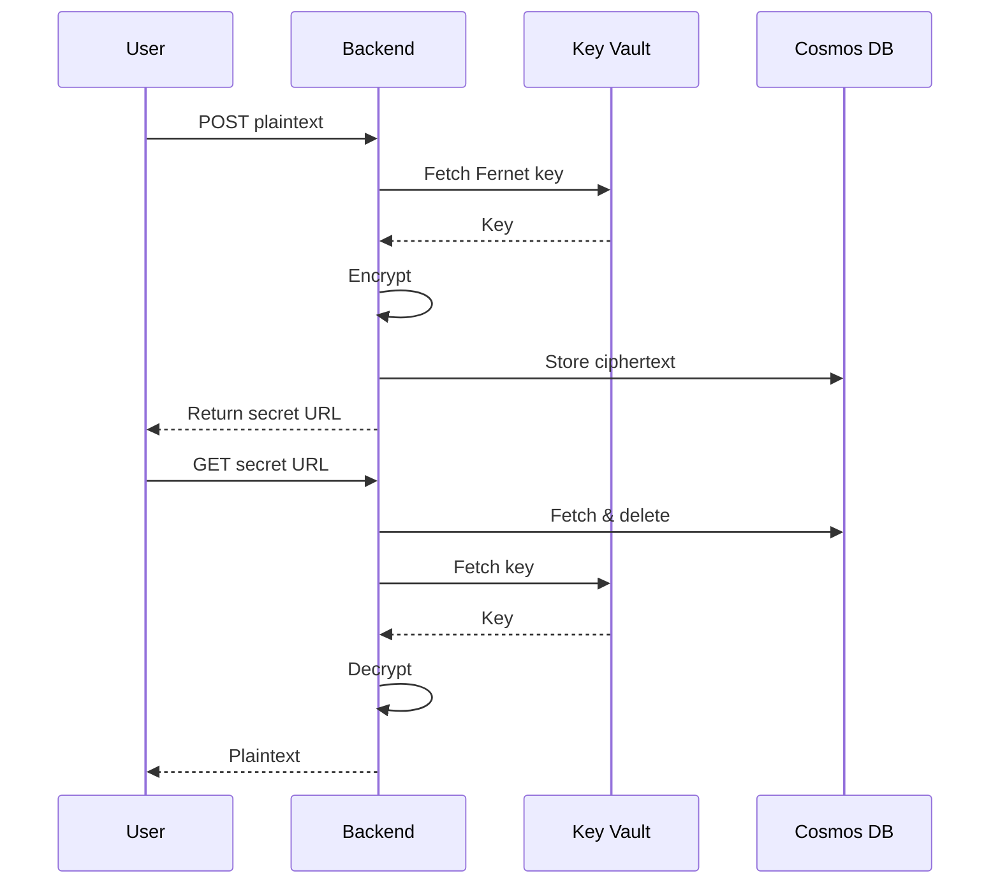

# Architecture Overview

## System Components & Data Flow

Transio is a **secure secret‑sharing application** with two deployment flavors optimized for distinct workloads:

* **Static Web Apps + Container Apps** – serverless, cost‑effective, auto‑scaling for SMB or hobby usage.
* **Azure Kubernetes Service (AKS ≥ 1.30)** – enterprise‑grade, full Kubernetes ecosystem.

### Core Application Diagram

```mermaid
graph TB
  %% ─── Sub-graphs ──────────────────────────
  subgraph "Client"
    UI["Web Frontend<br>Vanilla JS + E2EE"]
  end

  subgraph "Backend API"
    API["Flask API<br>Python 3.13"]
  end

  subgraph "Data Layer"
    DB[(Cosmos DB<br>TTL auto-cleanup)]
  end

  subgraph "Security Layer"
    KV["Azure Key Vault<br>Master keys"]
    ENC["Encryption Engine<br>Browser / API"]
  end

  %% ─── Data-flow links ─────────────────────
  UI  -->|HTTPS + JSON| API
  API -->|NoSQL| DB
  API -->|Key retrieval| KV
  UI  -.->|E2EE| ENC
  API -.->|Fernet| ENC

  ```

*Legend –* UI = browser; API = Flask app; DB = Cosmos DB; ENC runs either in the browser (E2EE) or the API (Fernet).

---

## Deployment Options

### Option 1 – Static Web Apps + Container Apps *(recommended for SMB)*

```mermaid
graph TB
  subgraph "Azure Static Web Apps"
    SWA[Static Frontend<br/>Global CDN + SSL]
  end
  subgraph "Azure Container Apps"
    CA[Backend API<br/>Auto-scaling]
  end
  subgraph "Shared Services"
    DB[(Cosmos DB)]
    KV[Key Vault]
    ACR[Container Registry]
  end
  subgraph Identity
    MI[Managed Identity]
  end

  Users --> SWA
  SWA -->|/api/*| CA
  CA --> DB
  CA --> KV
  CA --> MI
  CA --> ACR
```

**Why choose it?** Zero servers to patch, pay‑per‑use, and near‑instant scaling.

### Option 2 – Azure Kubernetes Service *(recommended for Enterprise)*

```mermaid
graph TB
    subgraph "Azure Application Gateway + WAF"
        AG[App Gateway]
    end
    subgraph "AKS Cluster"
        FE[Frontend Deployment\nNginx]
        BE[Backend Deployment\nFlask]
    end
    subgraph "Azure Services"
        DB[(Cosmos DB)]
        KV[Key Vault]
        ACR[Container Registry]
    end
    subgraph "Security"
        WI[Workload Identity]
        CSI[CSI Secrets Driver]
        CNI[Azure CNI NetworkPolicy]
    end

    Users --> AG
    AG --> FE
    FE --> BE
    BE --> DB
    BE --> CSI
    CSI --> KV
    WI --> KV
    {FE,BE} --> ACR
```

**Why choose it?** Azure CNI for integrated VNet networking and pod‑level isolation.

---

## Core Components

### Frontend (Vanilla JS)

* **Client‑side encryption** – Argon2id (**3 iterations / 64 MiB RAM / 4 threads**) + **AES‑256‑GCM** (Web Crypto)
* **Security‑first** – strict Content‑Security‑Policy via meta tag and HTTPS‑only transport
* **Responsive & accessible** – mobile‑friendly, WCAG‑aligned

### Backend (Flask 3.13)

* **Dual encryption modes** – browser E2EE *or* server‑side **Fernet (AES‑128‑CBC + HMAC‑SHA‑256)**
* **Hardened container** – non‑root UID, `memlock` RLIMIT, distroless base (41 MB)
* **Observability** – `/health` endpoint for readiness / liveness probes

#### Key API Endpoints

| Endpoint                 | Method | Purpose                         |
| ------------------------ | ------ | ------------------------------- |
| `/api/share`             | POST   | Store encrypted secret          |
| `/api/share/secret/<id>` | GET    | One‑time retrieve & auto‑delete |
| `/health`                | GET    | Liveness / readiness probe      |

### Data Layer (Cosmos DB)

* **Automatic TTL** – secrets expire after 24 h (configurable)
* **One‑time access** – document deleted immediately after retrieval

### Security Architecture

#### Dual Encryption Model

1. **End‑to‑End Encryption (E2EE)** – passphrase → Argon2id → AES‑256‑GCM; server stores ciphertext only.
2. **Server‑side Encryption** – backend encrypts with Fernet; master keys in Key Vault; **30‑day key rotation** enforced via MultiFernet.

#### Key Management

* Azure Key Vault + Workload Identity (credential‑less)
* Key rotation & audit logging via Managed HSM events

---

## Infrastructure Deployment

### Layered Bicep

1. **0‑landing‑zone/** – base networking, guardrails, policies
2. **10‑bootstrap‑kv/** – seed Key Vault & Managed HSM
3. **20‑platform‑{aks|swa}/** – AKS cluster (Azure CNI) *or* Container Apps environment
4. **30‑workload‑swa/** – application release

### CI/CD (GitHub Actions)

* Build → Trivy v0.50 + CodeQL JavaScript/Python → ACR push
* Helm/Bicep release gated on 100 % scan pass

---

## Defense‑in‑Depth Matrix

| Layer          | Controls                                                                |
| -------------- | ----------------------------------------------------------------------- |
| Transport      | TLS 1.3 everywhere (frontend, API)                                      |
| Application    | Pydantic input schemas, strict CSP, HTTPS‑only                          |
| Data           | AES‑256‑GCM (E2EE) or Fernet (server) at rest & in transit              |
| Infrastructure | Azure CNI NetworkPolicy, RBAC‑scoped service accounts, Managed Identity |
| Operations     | Trivy image scan, Dependabot auto‑patch, Azure Monitor audit logs       |

---

## Cryptographic Flows

### E2EE Sequence



### Server‑side Fernet Sequence



---

*Next: Dive into the complete [security controls](security.md) layered through every component of Transio.*