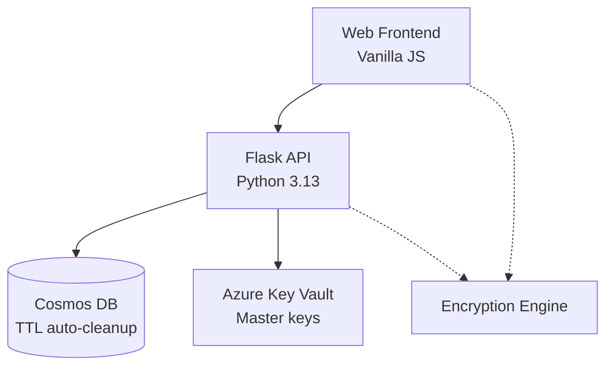
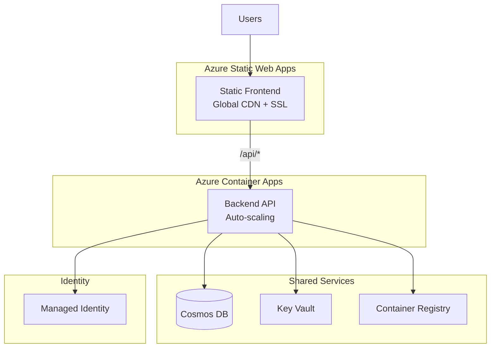
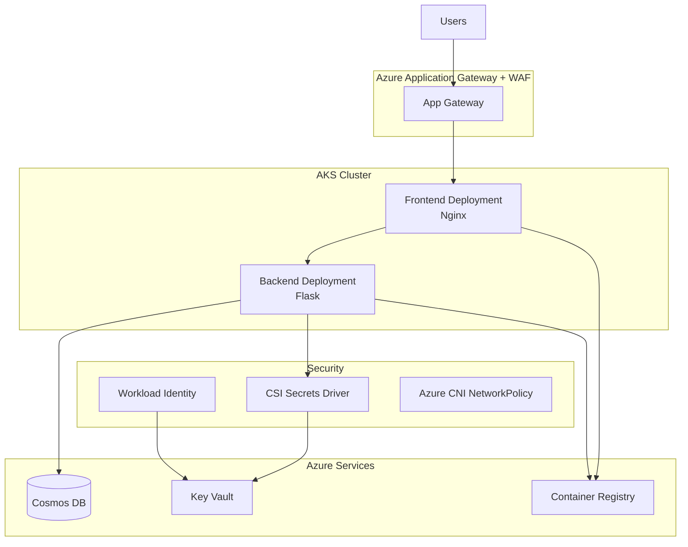
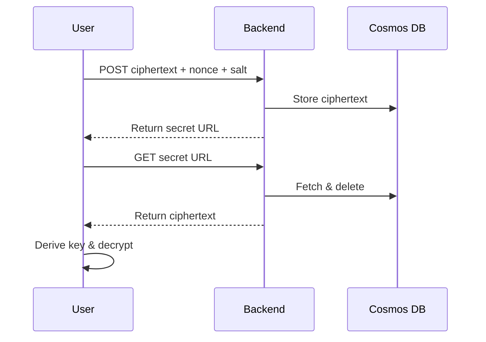
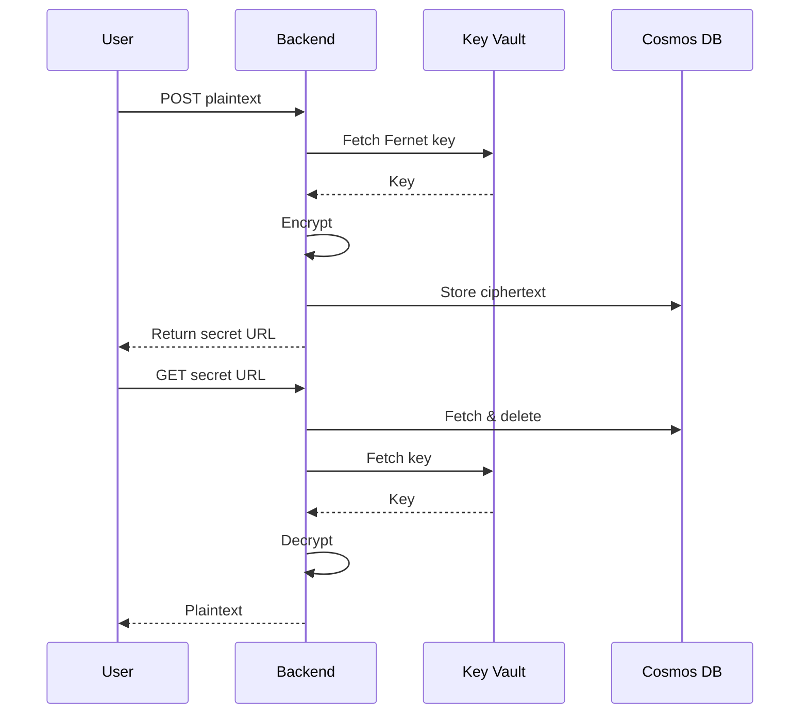

# Architecture Overview

## System Components & Data Flow

Transio is a **secure secret‑sharing application** with two deployment flavors optimized for distinct workloads:

* **Static Web Apps + Container Apps** – serverless, cost‑effective, auto‑scaling for SMB or hobby usage.
* **Azure Kubernetes Service (AKS ≥ 1.30)** – enterprise‑grade, full Kubernetes ecosystem.

### Core Application Diagram

*Legend –* UI = browser; API = Flask app; DB = Cosmos DB; ENC runs either in the browser (E2EE) or the API (Fernet).

---

## Deployment Options

### Option 1 – Static Web Apps + Container Apps *(recommended for SMB)*

**Why choose it?** Zero servers to patch, pay‑per‑use, and near‑instant scaling.

### Option 2 – Azure Kubernetes Service *(recommended for Enterprise)*

**Why choose it?** Azure CNI for integrated VNet networking and pod‑level isolation.

---

## Core Components

### Frontend (Vanilla JS)

* **Client‑side encryption** – Argon2id (**3 iterations / 64 MiB RAM / 4 threads**) + **AES‑256‑GCM** (Web Crypto)
* **Security‑first** – strict Content‑Security‑Policy via meta tag and HTTPS‑only transport
* **Responsive & accessible** – mobile‑friendly, WCAG‑aligned

### Backend (Flask 3.13)

* **Dual encryption modes** – browser E2EE *or* server‑side **Fernet (AES‑128‑CBC + HMAC‑SHA‑256)**
* **Hardened container** – non‑root UID, `memlock` RLIMIT, distroless base (41 MB)
* **Observability** – `/health` endpoint for readiness / liveness probes

#### Key API Endpoints

| Endpoint                 | Method | Purpose                         |
| ------------------------ | ------ | ------------------------------- |
| `/api/share`             | POST   | Store encrypted secret          |
| `/api/share/secret/<id>` | GET    | One‑time retrieve & auto‑delete |
| `/health`                | GET    | Liveness / readiness probe      |

### Data Layer (Cosmos DB)

* **Automatic TTL** – secrets expire after 24 h (configurable)
* **One‑time access** – document deleted immediately after retrieval

### Security Architecture

#### Dual Encryption Model

1. **End‑to‑End Encryption (E2EE)** – passphrase → Argon2id → AES‑256‑GCM; server stores ciphertext only.
2. **Server‑side Encryption** – backend encrypts with Fernet; master keys in Key Vault; **30‑day key rotation** enforced via MultiFernet.

#### Key Management

* Azure Key Vault + Workload Identity (credential‑less)
* Key rotation & audit logging via Managed HSM events

---

## Infrastructure Deployment

### Layered Bicep

1. **0‑landing‑zone/** – base networking, guardrails, policies
2. **10‑bootstrap‑kv/** – seed Key Vault & Managed HSM
3. **20‑platform‑{aks|swa}/** – AKS cluster (Azure CNI) *or* Container Apps environment
4. **30‑workload‑swa/** – application release

### CI/CD (GitHub Actions)

* Build → Trivy v0.50 + CodeQL JavaScript/Python → ACR push
* Helm/Bicep release gated on 100 % scan pass

### Key Vault Bootstrap & Key Rotation Workflows

The infrastructure deployment includes two critical GitHub Actions workflows for Key Vault management:

#### Key Vault Bootstrap (`cd-infra-keyvault.yml`)

Deploys the platform-specific Key Vault infrastructure:

- **Trigger**: Manual workflow dispatch
- **Inputs**: Environment (`dev`/`prod`) and Platform (`swa`/`aks`)
- **Process**:
  1. Validates resource group existence
  2. Deploys Key Vault using Bicep with platform-specific parameters
  3. Supports Key Vault soft-delete recovery via `KEYVAULT_RECOVER` variable
  4. Automatically triggers key rotation workflow on success
- **Security**: Uses `CLIENTID_IAC_CONTRIBUTOR` federated identity

#### Key Rotation (`cd-infra-rotate-key.yml`)

Seeds or rotates Fernet encryption keys:

- **Trigger**: Automatic (from Key Vault deployment) or manual dispatch
- **Process**:
  1. Generates cryptographically secure Fernet key using Python's `cryptography` library
  2. Stores key as `encryption-key` secret in Key Vault
- **Security**: Uses `CLIENTID_IAC_SECRETS` federated identity (least privilege)

#### SWA Deployment Token Rotation (`cd-rotate-deployment-token.yml`)

Rotates Static Web App deployment tokens for secure CI/CD:

- **Trigger**: 
  - **Automatic**: Monthly rotation (1st day of month at 02:00 UTC)
  - **Manual**: Workflow dispatch for immediate rotation
- **Process**:
  1. Generates new SWA deployment token via Azure CLI
  2. Stores token as `SWA-DEPLOYMENT-TOKEN` secret in Key Vault
  3. Updates token for both dev and prod environments when scheduled
- **Security**: Uses separate federated identities for SWA management (`CLIENTID_IAC_CONTRIBUTOR`) and Key Vault access (`CLIENTID_IAC_SECRETS`)

**Security Pattern**: Infrastructure deployment (Contributor) and secret management (Secrets User) use separate service principals following the principle of least privilege.

---

## Defense‑in‑Depth Matrix

| Layer          | Controls                                                                |
| -------------- | ----------------------------------------------------------------------- |
| Transport      | TLS 1.3 everywhere (frontend, API)                                      |
| Application    | Pydantic input schemas, strict CSP, HTTPS‑only                          |
| Data           | AES‑256‑GCM (E2EE) or Fernet (server) at rest & in transit              |
| Infrastructure | Azure CNI NetworkPolicy, RBAC‑scoped service accounts, Managed Identity |
| Operations     | Trivy image scan, Dependabot auto‑patch, Azure Monitor audit logs       |

---

## Cryptographic Flows

### E2EE Sequence

### Server‑side Fernet Sequence

---

*Next: Dive into the complete [security controls](security.md) layered through every component of Transio.*