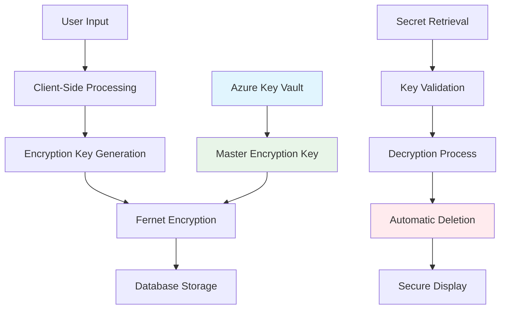

# Problem & Solution

## The Challenge: Secure Information Sharing

In today's digital landscape, sharing sensitive information securely remains a critical challenge. Traditional methods like email, messaging apps, or file sharing services often lack adequate security controls for truly confidential data.

### Common Pain Points

**🚨 Persistent Data Exposure**
: Most sharing methods leave permanent traces. Emails sit in inboxes, messages remain in chat histories, and files persist in cloud storage long after they're needed.

**🔓 Inadequate Encryption**
: Many platforms use encryption in transit but store data in plaintext on servers, creating potential breach points and compliance issues.

**🎯 Over-Broad Access**
: Traditional sharing often grants indefinite access, increasing the window of exposure and potential for unauthorized access.

**⚡ Complex Key Management**
: Existing secure solutions often require complex key exchange processes that are impractical for everyday use.

## The Solution: Transio's Approach

Transio addresses these challenges with a **zero-knowledge, self-destructing secret sharing platform** that prioritizes security without sacrificing usability.

### Core Security Principles

**🔐 End-to-End Encryption**
: Secrets are encrypted using industry-standard Fernet encryption before storage. The master encryption key is securely managed in Azure Key Vault, ensuring even system administrators cannot access raw secret data.

**💥 Automatic Destruction**
: Secrets are automatically deleted after a single view or expiration timeout, implementing the principle of minimal data retention. No forensic recovery is possible once a secret is destroyed.

**🎯 Zero-Knowledge Architecture**
: The system is designed so that even with full server access, encrypted secrets cannot be decrypted without the proper keys and access patterns.

## Why End-to-End Encryption Matters

### Threat Model

Transio's security model protects against three primary threat vectors:

!!! danger "**Server Compromise**"
    Even if an attacker gains full access to the application servers and database, they cannot decrypt stored secrets without access to the Azure Key Vault encryption keys.

!!! warning "**Data Breach**"
    In the event of a database breach, all stored secrets remain encrypted with strong cryptographic algorithms, making the data useless to attackers.

!!! info "**Insider Threats**"
    System administrators and developers cannot access user secrets in plaintext, reducing the risk of malicious or accidental data exposure.

### Cryptographic Implementation

### Security Benefits

| Feature | Traditional Methods | Transio Approach |
|---------|-------------------|------------------|
| **Data Persistence** | Permanent storage | Self-destructing |
| **Encryption** | Transport-only or none | End-to-end with Key Vault |
| **Access Control** | Indefinite | Single-use links |
| **Audit Trail** | Limited or excessive | Minimal, privacy-focused |
| **Key Management** | Manual or insecure | Azure-managed, enterprise-grade |

## Real-World Applications

### DevOps & Infrastructure
- Sharing API keys, certificates, and credentials during deployment
- Temporary access tokens for CI/CD pipelines
- Database connection strings for development environments

### Business Operations
- Confidential client information during project handoffs
- Temporary passwords for shared accounts
- Sensitive contract details or financial information

### Personal Use
- Sharing passwords with family members
- Temporary access codes for smart home devices
- Medical information or personal identification numbers

## Compliance & Governance

Transio's architecture supports various compliance frameworks:

- **GDPR**: Right to erasure implemented through automatic deletion
- **HIPAA**: Strong encryption and access controls for healthcare data
- **SOX**: Audit trails and data retention policies
- **PCI DSS**: Secure handling of payment-related information

!!! tip "Enterprise Ready"
    The platform's cloud-native architecture on Azure Kubernetes Service provides enterprise-grade scalability, monitoring, and disaster recovery capabilities.

---

*Next: Learn about the [technical architecture](architecture.md) behind Transio's security features.*