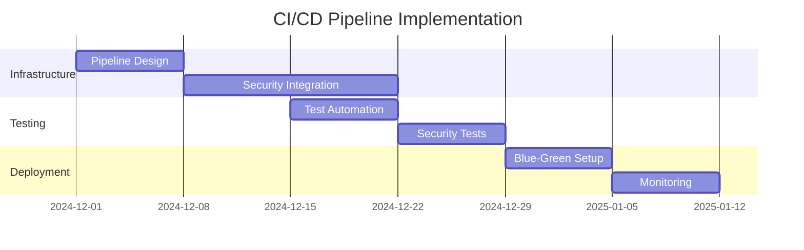

# Roadmap & Future Enhancements

## Project Status

Transio is under **active development** with a focus on enhancing security features, operational capabilities, and deployment options. The current version provides a production-ready foundation with comprehensive security controls.

## 🚀 Next Priority: Full CI/CD Pipeline Automation

### Objective
Establish a robust, enterprise-grade CI/CD pipeline that integrates automated security scanning, testing, and secure deployment strategies.

**Status**: 🔄 In Progress  
**Target**: Q1 2025  
**Effort**: 3-4 weeks

#### Key Components
- **Advanced Security Scanning**: Integration of SAST, DAST, and IAST tools
- **Automated Testing**: Comprehensive test automation with security validation
- **Blue-Green Deployments**: Zero-downtime deployment strategies
- **Compliance Automation**: Automated compliance checking and reporting
- **Rollback Capabilities**: Automated rollback on security or performance issues

#### Implementation Plan


## 💰 Low-Cost 24x7 Demo Environment

### Objective
Deploy a cost-effective, continuously available demonstration platform to showcase Transio's capabilities to potential employers and stakeholders.

**Status**: 📋 Planned  
**Target**: Q2 2025  
**Effort**: 2-3 weeks

#### Platform Options

**Option A: Azure Container Apps**
- **Pros**: Serverless scaling, cost-effective for demos
- **Cons**: Limited Kubernetes features
- **Estimated Cost**: $15-30/month

**Option B: AKS with Spot Instances**
- **Pros**: Full Kubernetes capabilities, significant cost savings
- **Cons**: Potential interruptions (mitigated with proper architecture)
- **Estimated Cost**: $25-50/month

**Option C: Static Web Apps + Container Apps**
- **Pros**: Optimal cost for frontend + serverless backend
- **Cons**: Different deployment model from production
- **Estimated Cost**: $10-20/month

#### Features
- **Live Demo**: Functional secret sharing with real encryption
- **Monitoring Dashboard**: Public health and performance metrics
- **Documentation**: Integrated with this documentation site
- **Security Showcase**: Visible security controls and audit logs

## 🛡️ Advanced Security Enhancements

### Formal Threat Modeling

**Status**: 📋 Planned  
**Target**: Q1 2025  
**Effort**: 2 weeks

Conduct a comprehensive STRIDE analysis to proactively identify and mitigate security threats:

#### STRIDE Analysis Components
- **Spoofing**: Identity verification and authentication controls
- **Tampering**: Data integrity and cryptographic controls  
- **Repudiation**: Audit logging and non-repudiation mechanisms
- **Information Disclosure**: Data classification and access controls
- **Denial of Service**: Rate limiting and resource protection
- **Elevation of Privilege**: Authorization and privilege management

#### Deliverables
- **Threat Model Document**: Comprehensive security analysis
- **Risk Register**: Prioritized list of identified threats
- **Mitigation Plan**: Security controls implementation roadmap
- **Security Architecture**: Updated architecture with enhanced controls

### Zero-Trust Architecture Enhancement

**Status**: 💡 Conceptual  
**Target**: Q3 2025  
**Effort**: 4-6 weeks

Implement comprehensive zero-trust principles:

- **Service Mesh**: Istio implementation for mTLS and traffic policies
- **Policy Engine**: Open Policy Agent (OPA) for fine-grained access control
- **Continuous Verification**: Real-time security posture assessment
- **Micro-Segmentation**: Enhanced network isolation with Calico

### Advanced Cryptography

**Status**: 💡 Conceptual  
**Target**: Q4 2025  
**Effort**: 3-4 weeks

- **Post-Quantum Cryptography**: Preparation for quantum-resistant algorithms
- **Hardware Security Modules**: Azure Dedicated HSM integration
- **Key Escrow**: Enterprise key recovery capabilities
- **Forward Secrecy**: Perfect forward secrecy for all communications

## 🔍 Observability & Monitoring

### Advanced Monitoring Stack

**Status**: 📋 Planned  
**Target**: Q2 2025  
**Effort**: 2-3 weeks

#### Components
- **Metrics**: Prometheus + Grafana dashboards
- **Logging**: Structured logging with Azure Monitor
- **Tracing**: Distributed tracing with Jaeger
- **Alerting**: Intelligent alerting with Azure Application Insights

#### Key Metrics
```yaml
# Monitoring Objectives
Availability: >99.9%
Response Time: <200ms (p95)
Error Rate: <0.1%
Security Events: Real-time alerting
```

### Security Information and Event Management (SIEM)

**Status**: 💡 Conceptual  
**Target**: Q3 2025

- **Azure Sentinel**: Security orchestration and automated response
- **Threat Intelligence**: Integration with threat feeds
- **Machine Learning**: Anomaly detection for security events
- **Compliance Reporting**: Automated compliance dashboards

## 🌐 Platform Expansion

### Multi-Cloud Support

**Status**: 💡 Future  
**Target**: 2026

Expand deployment options beyond Azure:

- **AWS**: EKS deployment with AWS security services
- **Google Cloud**: GKE with Google Cloud security stack  
- **Hybrid**: Cross-cloud disaster recovery and data sovereignty

### Enterprise Features

**Status**: 💡 Future  
**Target**: 2026

- **Multi-Tenancy**: Organization and user management
- **SSO Integration**: SAML/OIDC with enterprise identity providers
- **API Management**: Rate limiting, quotas, and developer portal
- **White-Label**: Customizable branding and deployment options

## 📱 User Experience Enhancements

### Mobile Applications

**Status**: 💡 Future  
**Target**: 2026

- **iOS App**: Native Swift application with biometric authentication
- **Android App**: Kotlin application with hardware security module
- **Progressive Web App**: Enhanced mobile experience with offline capabilities

### Advanced Features

**Status**: 💡 Future

- **File Sharing**: Secure file upload and sharing capabilities
- **Collaboration**: Multi-user secret sharing with approval workflows
- **Integration APIs**: Webhook and API integrations for enterprise systems
- **Backup & Recovery**: User-controlled backup and recovery options

## 🎯 Success Metrics

### Development Metrics
- **Code Coverage**: Maintain >85% test coverage
- **Security Vulnerabilities**: Zero high/critical vulnerabilities in production
- **Documentation**: 100% API documentation coverage
- **Performance**: <100ms response time for 95% of requests

### Business Metrics
- **Demo Engagement**: Track demo usage and feedback
- **Security Showcase**: Measure interest from security professionals
- **Portfolio Impact**: Track job interview requests and opportunities
- **Community**: GitHub stars, forks, and contributions

## 🤝 Contributing

### How to Get Involved

The Transio project welcomes contributions from security professionals, developers, and DevOps engineers:

#### Contribution Areas
- **Security Reviews**: Code audits and vulnerability assessments
- **Feature Development**: New security controls and capabilities
- **Documentation**: Technical writing and architecture documentation
- **Testing**: Security testing and penetration testing
- **Infrastructure**: Cloud architecture and deployment automation

#### Getting Started
1. **Fork the Repository**: Create your own copy for development
2. **Read the Guidelines**: Follow security-first development practices
3. **Submit Issues**: Report bugs or suggest enhancements
4. **Pull Requests**: Submit well-tested, documented changes
5. **Security Reviews**: Participate in security design discussions

### Recognition
Contributors will be acknowledged in the project documentation and may be featured in professional portfolios as collaborators on enterprise security projects.

---

## Release History Placeholder

*Future releases will be documented in the [Changelog](CHANGELOG.md) with semantic versioning and detailed security impact analysis.*

---

*This roadmap is subject to change based on security landscape evolution, technology advances, and stakeholder feedback. Priority is always given to security enhancements and vulnerability mitigation.*