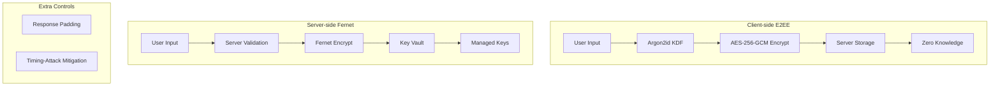
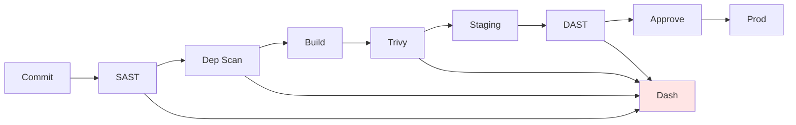

# Security Controls & Architecture

## Executive Summary

Transio delivers a **production‑grade, zero‑knowledge security architecture** built for cloud‑native, enterprise workloads on Azure. The design merges modern cryptography with layered cloud controls to ensure that even an infrastructure compromise cannot expose user secrets.

### 🔒 Advanced Cryptographic Engineering

* **Dual encryption model** – browser E2EE (Argon2id + AES‑256‑GCM) and server‑side Fernet
* **Zero‑knowledge design** – servers store ciphertext only; cannot decrypt E2EE payloads
* **Key governance** – Azure Key Vault + HSM with 30‑day automatic rotation

### 🛡️ Defence‑in‑Depth Implementation

* Full alignment with **OWASP Top 10 (2021)**
* 29 dedicated security tests across backend and frontend covering crypto, validation, access control, and containers
* Anti‑enumeration padding to neutralise timing‑based reconnaissance

### ☁️ Cloud‑Native Best Practices

* Azure Workload Identity (no static credentials)
* Distroless, non‑root containers (UID 101, capabilities dropped)
* Network isolation via Azure CNI NetworkPolicy and private endpoints

---

## Advanced Security Architecture

### Dual Encryption Model



### Cryptographic Parameters

| Component         | Algorithm                                         | Key Length                 | Parameters                      |
| ----------------- | ------------------------------------------------- | -------------------------- | ------------------------------- |
| **KDF**           | Argon2id                                          | 256‑bit                    | 3 iterations, 64 MiB, 4 threads |
| **E2EE Cipher**   | AES‑256‑GCM                                       | 256‑bit                    | 96‑bit nonce, AEAD              |
| **Server Cipher** | Fernet                                            | AES‑128‑CBC + HMAC‑SHA‑256 | MultiFernet rotation            |
| **RNG**           | Browser `crypto.getRandomValues()` / `os.urandom` | 256‑bit                    | CSPRNG                          |
| **Key Store**     | Azure Key Vault                                   | HSM‑backed                 | 30‑day rotation                 |

---

## Security Controls Matrix

### Application Layer

| Control          | Implementation                         | Risk Mitigated      |
| ---------------- | -------------------------------------- | ------------------- |
| Input validation | Pydantic schemas (≤ 100 KiB)           | Injection, DoS      |
| Response padding | 150 KiB target size                    | Enumeration, timing |
| Error handling   | Generic HTTP 4xx/5xx + structured logs | Data leakage        |
| CORS policy      | Flask‑CORS (env‑aware)                 | X‑site abuse        |
| CSP              | Meta‑tag Content‑Security‑Policy       | XSS, inline JS      |

### Cryptography

| Feature              | Implementation     | Benefit                     |
| -------------------- | ------------------ | --------------------------- |
| MultiFernet          | Sliding key window | Seamless rotation           |
| Memory‑hard KDF      | Argon2id 64 MiB    | GPU/ASIC resilience         |
| Authenticated cipher | AES‑256‑GCM        | Confidentiality + integrity |
| Zero‑knowledge       | No key on server   | Insider threat defence      |

### Infrastructure (Azure)

| Layer      | Control                 | Monitoring               |
| ---------- | ----------------------- | ------------------------ |
| Containers | Distroless, UID 101     | Trivy scans              |
| Network    | Azure CNI NetworkPolicy | NSG + Container Insights |
| Identity   | Workload Identity (AAD) | AAD logs                 |
| Secrets    | Key Vault CSI driver    | KV audit logs            |
| IaC        | Bicep security baseline | Drift detection          |

---

## OWASP Top 10 (2021) Compliance Snapshot

| ID                        | Mitigation Highlight           | Status |
| ------------------------- | ------------------------------ | ------ |
| A01 Broken Access Control | RBAC, NetworkPolicy            | ✅      |
| A02 Crypto Failures       | AES‑256‑GCM, Fernet, KV        | ✅      |
| A03 Injection             | Pydantic, JSON schema          | ✅      |
| A04 Insecure Design       | Threat modelling, zero‑trust   | ✅      |
| A05 Security Misconfig    | IaC baseline, Trivy scans      | ✅      |
| A06 Vulnerable Components | Dependabot, image scan         | ✅      |
| A07 Id & Auth Failures    | Workload Identity              | ✅      |
| A08 Integrity Failures    | Signed containers              | ✅      |
| A09 Logging & Monitoring  | Structured logs, Azure Monitor | ✅      |
| A10 SSRF                  | Egress filters                 | ✅      |

---

## Anti‑Enumeration Padding (Python)

```python
TARGET = 150 * 1024  # 150 KiB

def pad(resp: dict) -> dict:
    body = json.dumps(resp).encode()
    pad_len = max(0, TARGET - len(body))
    if pad_len:
        resp["_pad"] = secrets.token_urlsafe(pad_len)
    return resp
```

## Client‑side Crypto Snippet (JavaScript)

```javascript
const { hash: key } = await argon2.hash({
  pass: passphrase,
  salt,
  hashLen: 32,
  time: 3,
  mem: 1 << 16,   // 64 MiB
  parallelism: 4,
  type: argon2.ArgonType.Argon2id
});
const ciphertext = await crypto.subtle.encrypt(
  { name: 'AES-GCM', iv: nonce },
  key,
  plaintext
);
```

## Server‑side MultiFernet (Python)

```python
from cryptography.fernet import Fernet, MultiFernet
keys = Config.MASTER_KEYS
cipher = MultiFernet([Fernet(k) for k in keys])

def encrypt(txt: str) -> bytes:
    return cipher.encrypt(txt.encode())
```

---

## Security Test Coverage

```
📊 29 tests
├── Crypto: 6
├── Validation: 10
├── Access Control: 9
├── Enumeration: 2
└── Container: 2
```

---

## Vulnerability Management Pipeline



---

*This document captures Transio’s layered security posture: modern cryptography, zero‑trust design, and automated cloud defences—ready for enterprise scrutiny.*