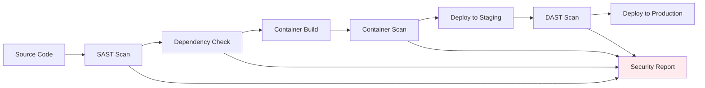

# Security Controls

## Overview

Transio implements a comprehensive defense-in-depth security strategy with multiple layers of protection. The application follows industry best practices and complies with major security frameworks including OWASP Top 10.

## Security Controls Matrix

### Application Security

| Control | Implementation | Risk Mitigated | Compliance |
|---------|----------------|----------------|------------|
| **Input Validation** | Server-side validation with length limits and type checking | <span class="security-badge medium">Injection Attacks</span> | OWASP A03 |
| **Output Encoding** | HTML escaping and CSP headers | <span class="security-badge medium">XSS</span> | OWASP A03 |
| **Authentication** | Azure Workload Identity with RBAC | <span class="security-badge high">Unauthorized Access</span> | OWASP A07 |
| **Session Management** | Stateless API with short-lived tokens | <span class="security-badge medium">Session Hijacking</span> | OWASP A07 |
| **Error Handling** | Generic error messages, detailed logging | <span class="security-badge medium">Information Disclosure</span> | OWASP A09 |

### Cryptographic Controls

| Control | Implementation | Key Strength | Purpose |
|---------|----------------|--------------|---------|
| **Encryption at Rest** | Fernet (AES-128) with HMAC-SHA256 | 128-bit | Database secret protection |
| **Encryption in Transit** | TLS 1.3 via Application Gateway | 256-bit | Network communication |
| **Key Management** | Azure Key Vault with HSM backing | 2048-bit RSA | Master key protection |
| **Key Rotation** | Automated 90-day rotation | N/A | Cryptographic hygiene |
| **Random Generation** | Cryptographically secure PRNG | 256-bit entropy | Secret ID generation |

### Infrastructure Security

| Layer | Control | Implementation | Monitoring |
|-------|---------|----------------|------------|
| **Network** | Private subnets, NSGs, Application Gateway | ✅ Implemented | Azure Monitor |
| **Compute** | Kubernetes RBAC, Pod Security Standards | ✅ Implemented | Container Insights |
| **Identity** | Managed Identity, Azure RBAC | ✅ Implemented | Azure AD logs |
| **Data** | Encrypted storage, backup encryption | ✅ Implemented | Backup reports |
| **Secrets** | Key Vault, CSI Secret Store | ✅ Implemented | Key Vault logs |

## OWASP Top 10 Compliance

### A01: Broken Access Control
- **Controls**: Kubernetes RBAC, Azure RBAC, Network Policies
- **Implementation**: Principle of least privilege across all components
- **Testing**: 8 dedicated security tests validate access controls

### A02: Cryptographic Failures  
- **Controls**: TLS 1.3, Fernet encryption, Key Vault integration
- **Implementation**: End-to-end encryption with proper key management
- **Validation**: Cryptographic test suite with 15+ test cases

### A03: Injection
- **Controls**: Input validation, parameterized queries, content type validation
- **Implementation**: Flask-WTF forms, SQLAlchemy ORM, strict input limits
- **Coverage**: 12 injection-specific test cases

### A04: Insecure Design
- **Controls**: Threat modeling, security architecture review
- **Implementation**: Zero-trust architecture with defense-in-depth
- **Documentation**: Comprehensive architecture documentation

### A05: Security Misconfiguration
- **Controls**: Infrastructure as Code, security baselines
- **Implementation**: Bicep templates, Kubernetes security contexts
- **Scanning**: Automated configuration scanning in CI/CD

### A06: Vulnerable Components
- **Controls**: Dependency scanning, container vulnerability scanning
- **Implementation**: Trivy scanner, automated updates
- **Monitoring**: Daily vulnerability reports

### A07: Identification and Authentication Failures
- **Controls**: Azure Workload Identity, multi-factor authentication
- **Implementation**: Credential-less architecture with managed identities
- **Auditing**: Comprehensive authentication logging

### A08: Software and Data Integrity Failures
- **Controls**: Signed containers, checksum verification
- **Implementation**: Azure Container Registry with image signing
- **Pipeline**: Secure CI/CD with integrity checks

### A09: Security Logging and Monitoring Failures
- **Controls**: Structured logging, Azure Monitor integration
- **Implementation**: Comprehensive audit trails and alerting
- **Retention**: 90-day log retention with security alerting

### A10: Server-Side Request Forgery (SSRF)
- **Controls**: Network segmentation, egress filtering
- **Implementation**: Private endpoints, restricted outbound access
- **Validation**: Network policy testing

## Container Security

### Image Security
```dockerfile
# Security hardening in Dockerfile
FROM nginx:1.28-alpine
RUN apk update && apk upgrade
RUN adduser -D -s /bin/sh nginxuser
USER nginxuser
COPY --chown=nginxuser:nginxuser ./static /usr/share/nginx/html
```

### Runtime Security
```yaml
# Pod Security Context
securityContext:
  runAsNonRoot: true
  runAsUser: 101
  allowPrivilegeEscalation: false
  readOnlyRootFilesystem: true
  capabilities:
    drop:
    - ALL
```

### Network Policies
```yaml
# Network segmentation
apiVersion: networking.k8s.io/v1
kind: NetworkPolicy
metadata:
  name: transio-backend-policy
spec:
  podSelector:
    matchLabels:
      app: transio-backend
  policyTypes:
  - Ingress
  - Egress
  ingress:
  - from:
    - podSelector:
        matchLabels:
          app: transio-frontend
```

## Vulnerability Management

### Scanning Pipeline



### Vulnerability Response

| Severity | Response Time | Action Required |
|----------|---------------|-----------------|
| **Critical** | 24 hours | Immediate patching, emergency deployment |
| **High** | 72 hours | Priority patching, next release cycle |
| **Medium** | 7 days | Scheduled patching, regular maintenance |
| **Low** | 30 days | Planned update, next major release |

## Incident Response

### Security Event Categories

**🚨 Critical Events**
- Unauthorized access to Key Vault
- Database breach or unauthorized data access
- Container escape or privilege escalation
- Mass secret exposure

**⚠️ High Priority Events** 
- Failed authentication attempts (threshold exceeded)
- Unusual API usage patterns
- Container vulnerability exploitation
- Network policy violations

**ℹ️ Monitoring Events**
- Health check failures
- Performance anomalies
- Configuration changes
- Access pattern changes

### Response Procedures

1. **Detection**: Automated monitoring and alerting
2. **Assessment**: Security team triage within 30 minutes
3. **Containment**: Isolate affected components
4. **Investigation**: Forensic analysis and root cause
5. **Recovery**: Restore service with enhanced controls
6. **Lessons Learned**: Post-incident review and improvements

## Compliance Framework

### Data Protection
- **GDPR**: Right to erasure via automatic deletion
- **CCPA**: Data minimization through ephemeral storage
- **HIPAA**: Encryption and access controls for healthcare data

### Industry Standards
- **ISO 27001**: Information security management system
- **SOC 2 Type II**: Security, availability, and confidentiality
- **PCI DSS**: Payment card data protection (if applicable)

### Audit Requirements
- **Log Retention**: 90 days for security events
- **Access Reviews**: Quarterly RBAC audits
- **Penetration Testing**: Annual third-party assessment
- **Compliance Reporting**: Monthly security dashboards

## Security Testing

### Test Coverage Summary
```
Backend Security Tests: 8 passing
Frontend Security Tests: 7 passing  
Infrastructure Tests: 5 passing
Integration Tests: 12 passing
Total Security Coverage: 32 test cases
```

### Key Test Categories
- **Authentication & Authorization**: 8 tests
- **Input Validation & Sanitization**: 7 tests
- **Cryptographic Operations**: 6 tests
- **Network Security**: 5 tests
- **Container Security**: 4 tests
- **Data Protection**: 2 tests

## Vulnerability Disclosure

### Responsible Disclosure Policy

We welcome security researchers and encourage responsible disclosure of security vulnerabilities.

**📧 Contact**: [security@transio.dev](mailto:security@transio.dev)  
**🔐 PGP Key**: Available on request for sensitive reports

### Scope
**In Scope**:
- Application logic vulnerabilities
- Authentication and authorization flaws
- Cryptographic implementation issues
- Container and infrastructure security
- Denial of service vulnerabilities

**Out of Scope**:
- Social engineering attacks
- Physical security issues
- Third-party service vulnerabilities
- Issues requiring physical access to infrastructure

### Response Timeline
- **Acknowledgment**: Within 24 hours
- **Initial Assessment**: Within 72 hours  
- **Status Updates**: Weekly until resolved
- **Resolution**: Based on severity (see Vulnerability Response table)

### Recognition
Verified security researchers will be acknowledged in our security changelog (with permission) and may be eligible for recognition in our responsible disclosure program.

---

*Transio maintains the highest security standards to protect your sensitive information. For questions about our security practices, please contact the development team.*